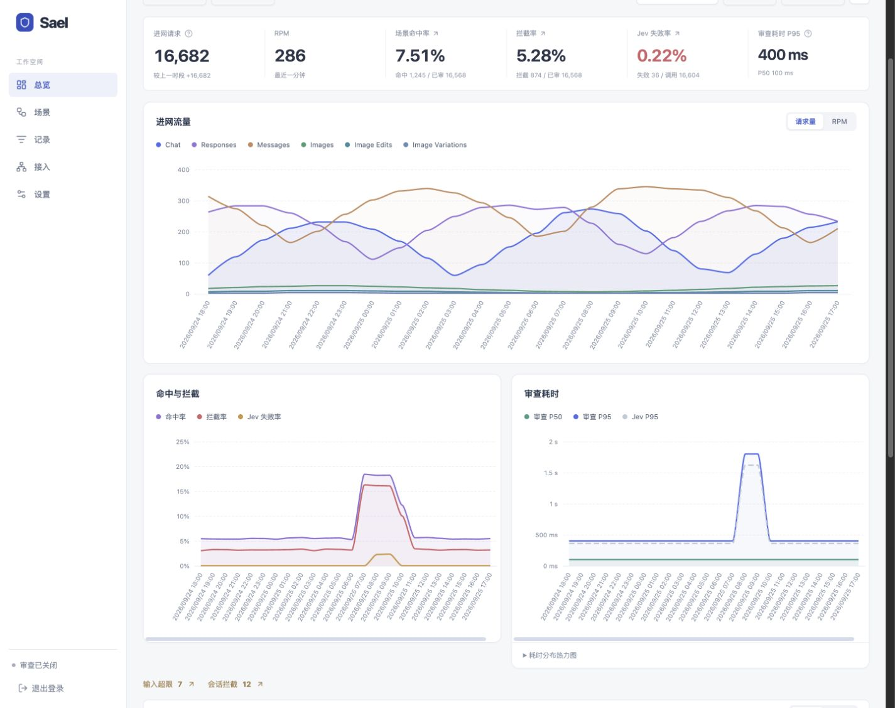
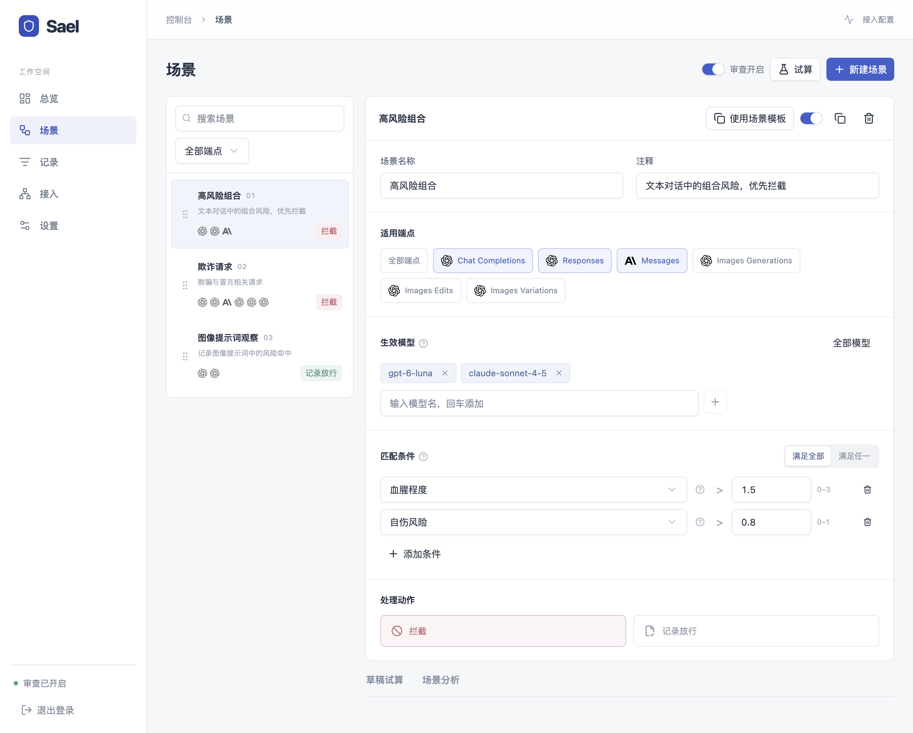
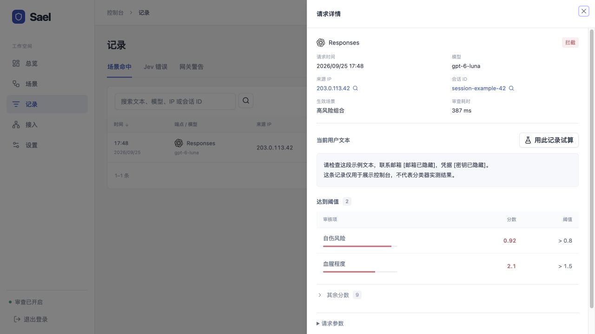
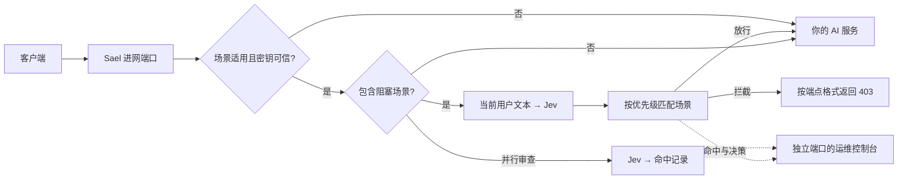

**简体中文** · [English](docs/README_en.md)

<div align="center">

# Sael

**可视化配置安全规则的 AI 中转网关**

按端点和模型配置文本审查，支持前置拦截与非阻塞记录。

[](https://github.com/cipherTing/sael/actions/workflows/ci.yml)
[](https://pkg.go.dev/github.com/cipherTing/sael/sdk)
[](LICENSE)

[快速启动](#快速启动) · [部署与配置](gateway/README.md) · [CLI 与 SDK](docs/cli.md)

</div>



## Sael 做什么

把 Sael 放在客户端与 AI 服务之间：客户端使用网关地址和原有凭据，Sael 将当前用户文本交给 **Jev 分类器**，支持**阻塞性审查**与**非阻塞性审查**：前者在转发前决定是否拦截，后者与转发并行、记录命中。未匹配的请求正常转发。

安全规则集中在控制台维护。你可以让某条规则只对指定模型和端点生效，组合多个风险条件，拖拽调整优先级，用真实文本试算后再开启审查。

| 你要解决的问题 | Sael 提供的能力 |
| --- | --- |
| 不同模型、接口需要不同规则 | 按端点和模型限定场景；条件支持“任一项”或“全部项” |
| 调规则之前想知道会影响什么 | 草稿试算、分类分数、逐场景匹配过程、从已有场景创建 |
| 想看审查是否健康、哪些规则经常命中 | 请求趋势、实时 RPM、命中率、拦截率、Jev 失败率与耗时、场景排行 |
| 需要定位一次拦截 | 请求端点、模型、IP、显式会话 ID、去敏文本、命中条件与分数 |
| 同一会话反复触发拦截 | 可选会话冻结，设置时长，到期自动恢复 |

## 规则由场景定义

例如，某个场景可以要求 **血腥程度 > 1.5 且自伤风险 > 0.8** 才拦截；另一个场景只记录命中并继续转发。阈值属于各自场景，首个匹配场景决定动作。



Jev 提供 11 个审核项：9 个 0–1 概率判断，以及色情、血腥两项 0–3 程度评分。控制台使用中文名称，量表说明收在问号中。

## 从趋势回到具体请求

总览把流量、决策比例和 Jev 健康放在同一视图。按时间、端点和模型筛选后，可以继续下钻到命中、Jev 失败或网关警告记录。



命中项优先展示，其余分数默认折叠。正常请求只保留计数和耗时聚合，不保存逐条记录、正文或分数分布。截图使用虚构样例数据，展示实际控制台。

## 如何工作



- **监控端点**：OpenAI Chat Completions、Responses、Anthropic Messages，以及 OpenAI Images 的 generations、edits、variations。生图只审 `prompt`；variations 没有文本，跳过文本审查。
- **可信密钥**：受监控业务请求首次成功后才启用该密钥的审查，首次请求不补审；默认闲置 30 天清除，可在设置中调整。
- **转发边界**：其他路径直接转发；保留原请求正文、认证信息和流式响应。历史对话、图片、音频与工具返回值不送给 Jev。
- **异常处理**：Jev 失败时记录并放行；输入超限时跳过 Jev、记录警告并放行。上游服务的错误不计为审核故障。
- **部署方式**：Go 网关、React 控制台、PostgreSQL 和 Redis，Docker Compose 启动。管理页面和业务进网使用不同端口。

## 快速启动

```sh
git clone https://github.com/cipherTing/sael.git
cd sael/gateway/deploy
cp .env.example .env
# 在 .env 中填写管理员、数据库、Redis 密码和出站根地址 UPSTREAM_URL
docker compose up --build -d
```

默认管理地址 **http://localhost:8080**，客户端进网地址 **http://localhost:8081**。客户端的 API 根地址通常填写 `http://localhost:8081/v1`，凭据继续使用上游原有密钥。

首次启动审查关闭。登录后，在 **接入**确认出站地址，在 **设置**配置并测试 Jev，再到 **场景**添加规则、试算并开启审查。端口、绑定地址与部署参数都在 `.env` 中维护。

完整步骤见 [网关部署文档](gateway/README.md)。

## CLI、SDK 与开发

只需要分类能力时，可以单独使用 CLI 或 Go SDK；它们返回分数，由调用方决定后续动作。

```sh
sael check "需要审查的文本"
cat prompt.txt | sael check --json
```

| 入口 | 内容 |
| --- | --- |
| [CLI 与 SDK](docs/cli.md) | 安装、命令行用法、Go 示例和分类器配置 |
| [网关部署与开发](gateway/README.md) | Docker、环境变量、审核边界、测试命令 |
| [贡献指南](CONTRIBUTING.md) | 本地开发与提交约定 |
| [安全说明](SECURITY.md) | 安全问题反馈 |

日志使用正则规则去除常见凭据和个人信息；分类器与上游仍收到原始文本。去敏无法覆盖所有敏感信息格式，部署前请了解[记录边界](gateway/README.md#请求记录与去敏)。

## 许可

[MIT](LICENSE)
