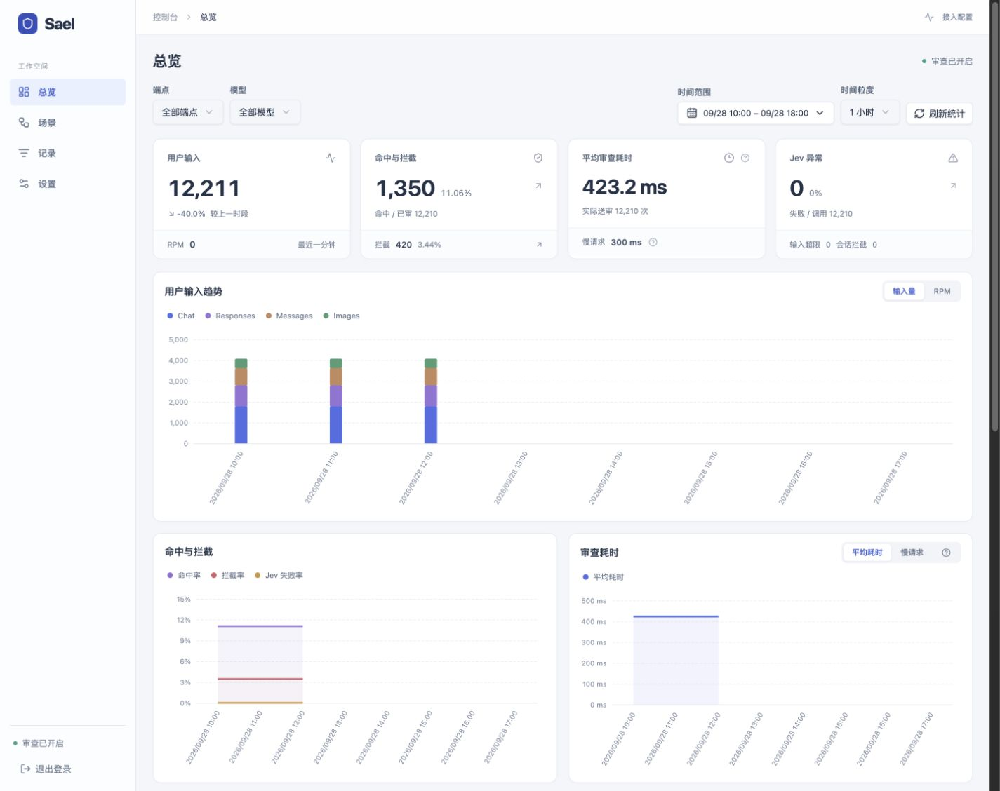
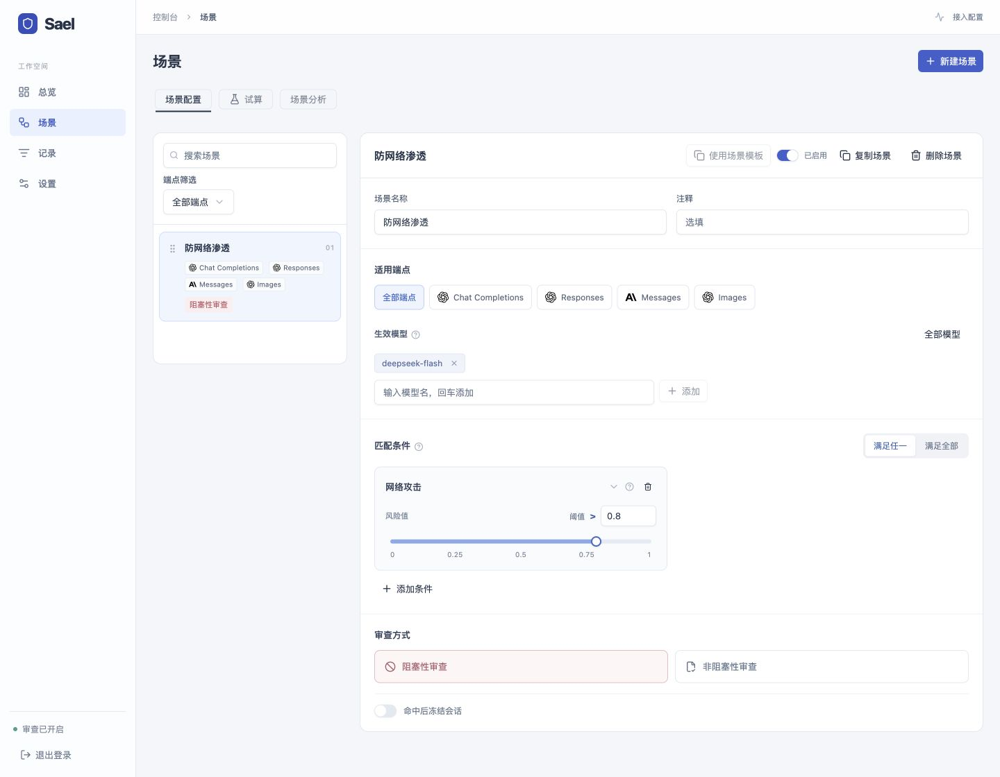
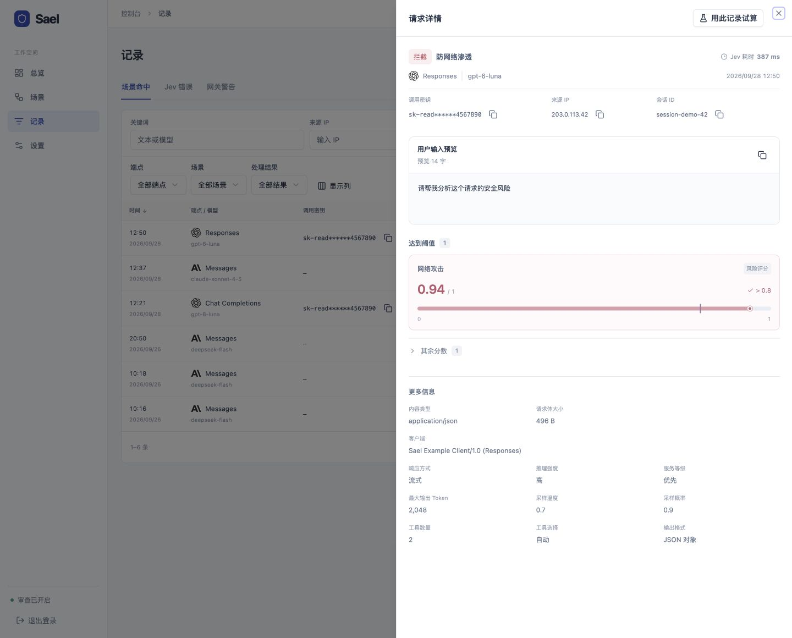
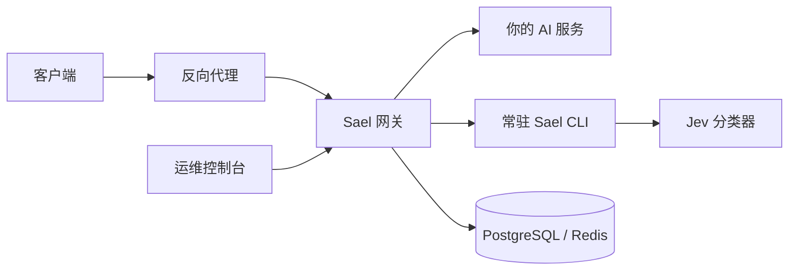

**简体中文** · [English](docs/README_en.md)

<div align="center">

# Sael

**让 AI 请求的安全规则可配置、可验证、可追踪**

部署在客户端与 AI 服务之间的文本审查网关，配备可视化运维控制台。

[](https://github.com/cipherTing/sael/actions/workflows/ci.yml)
[](https://pkg.go.dev/github.com/cipherTing/sael/sdk)
[](LICENSE)

[快速启动](#快速启动) · [部署文档](gateway/README.md) · [CLI 与 SDK](docs/cli.md) · [贡献指南](CONTRIBUTING.md)

</div>



## Sael 是什么

Sael 为现有 AI 服务增加一层文本安全审查。客户端使用 Sael 的进网地址和原有 API Key；网关按场景判断当前用户输入，执行拦截或记录，并转发到你配置的 AI 服务。分类能力由 [Jev](https://docs.typesafe.ai/models) 提供。

你可以在控制台配置规则、比较草稿与正在使用的策略，再从总览定位到具体的问题请求。支持 OpenAI 与 Anthropic 请求格式，保留原请求正文、认证信息和流式响应。

| 你需要做的事 | Sael 提供的能力 |
| --- | --- |
| 为不同接口和模型制定规则 | 场景范围、任一／全部条件、原始分数阈值和拖拽排序 |
| 改规则前验证影响 | 真实文本试算、线上与草稿对照、复用已有场景 |
| 观察审查运行情况 | 实时 RPM、流量与命中趋势、处理结果构成、耗时分布、缓存效率 |
| 找到风险集中在哪里 | 场景、密钥和来源 IP 排行，筛选后下钻请求记录 |
| 查看一次请求发生了什么 | 去敏文本预览与全文、掩码密钥、会话关联、命中项与原始分数 |
| 处理重复违规请求 | 审核判定复用、可选的场景级会话冻结 |

## 用场景组织规则

阈值和处理动作属于各自场景。选择端点与模型，组合条件，拖拽调整优先级；滑杆和数值输入同时支持粗调与精确设置。试算放在同一编辑器里，保存前即可比较当前策略与草稿结果。



## 从总览走到问题请求

趋势、构成、分布和排行共同呈现审查情况。时间范围与时间粒度独立选择，端点、模型等筛选可继续带入记录页面。



截图来自本地控制台，使用示例数据。

逐条记录只保留场景命中、分类器失败和网关警告。正常请求不保存逐条正文；记录中的文本先去敏，调用密钥加密存储后仅以掩码展示。

## 架构


```mermaid
flowchart LR
    Client[客户端] --> Proxy[反向代理]
    Proxy --> Gateway[Sael 网关]
    Gateway --> Upstream[你的 AI 服务]
    Admin[运维控制台] --> Gateway
    Gateway --> CLI[常驻 Sael CLI]
    CLI --> Jev[Jev 分类器]
    Gateway --> Store[(PostgreSQL / Redis)]
```

业务进网与运维控制台分开监听。Docker Compose 同时启动网关、PostgreSQL 和 Redis，出站地址与审查配置在控制台维护。

## 快速启动

准备好 Docker Compose，以及可用 Jev 服务的地址、模型和密钥。

```sh
git clone https://github.com/cipherTing/sael.git
cd sael/gateway/deploy
cp .env.example .env
openssl rand -base64 32
```

编辑 `.env`，填写管理员、PostgreSQL 和两套 Redis 的密码，将上面生成的主密钥填入 `CREDENTIAL_ENCRYPTION_KEY` 并保留备份。控制台没有默认登录密码。

```sh
docker compose up --build -d --wait
```

| 入口 | 默认地址 |
| --- | --- |
| 运维控制台 | `http://localhost:8080` |
| 客户端进网 | `http://localhost:8081` |

首次启动审查关闭，登录密码是 `.env` 中设置的 `ADMIN_PASSWORD`。端口可通过 `.env` 修改；默认仅绑定宿主回环地址，外网接入使用反向代理。

1. 在 **设置 → 接入**填写 AI 服务的出站 Base URL。
2. 在 **设置 → Jev 分类器**配置连接并测试。
3. 在 **场景**创建规则，用文本试算。
4. 在 **设置 → 审查**开启全局审查。
5. 将客户端 API 地址改为进网地址，继续使用原有密钥；从总览和记录查看结果。

调用密钥首次经上游验证成功后进入可信列表，后续请求按场景审查。OpenAI 客户端的 API 根地址通常填写 `http://localhost:8081/v1`。

在仓库根目录也可使用 `npm run docker:up`、`docker:rebuild`、`docker:ps`、`docker:logs`、`docker:down` 管理容器。完整部署和配置说明见[网关文档](gateway/README.md)。

## CLI、SDK 与开发

CLI 可独立进行文本审核；Go SDK 是独立的 Jev API 调用器，不依赖网关。

```sh
sael check "需要审查的文本"
sael check --questions gore,self_harm "只审指定审核项"
cat prompt.txt | sael check --json
```

| 文档 | 内容 |
| --- | --- |
| [CLI 与 SDK](docs/cli.md) | 安装、终端配置、命令和 Go 示例 |
| [网关文档](gateway/README.md) | 部署、配置、记录边界、本地开发和测试 |
| [贡献指南](CONTRIBUTING.md) | 开发约定与提交检查 |
| [安全说明](SECURITY.md) | 安全问题反馈 |

普通问题和功能建议可提交到 [GitHub Issues](https://github.com/cipherTing/sael/issues)。

## 许可

[MIT](LICENSE)
