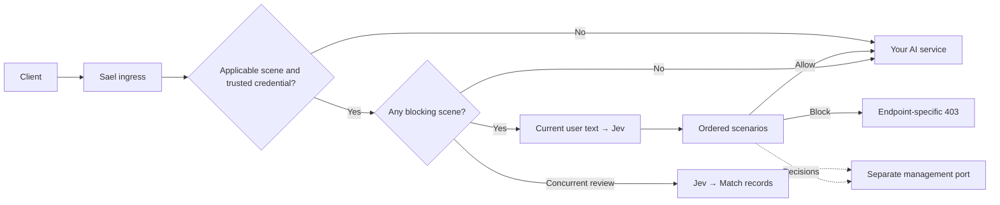

[简体中文](../README.md) · **English**

<div align="center">

# Sael

**An AI request gateway with visual safety rules**

Review user text before it reaches a model. Choose the rules for each endpoint and model.

[](https://github.com/cipherTing/sael/actions/workflows/ci.yml)
[](https://pkg.go.dev/github.com/cipherTing/sael/sdk)
[](../LICENSE)

[Quick start](#quick-start) · [Deployment guide](../gateway/README.md) · [CLI and SDK](cli_en.md)

</div>


## What Sael does

Sael sits between your clients and your AI service. Clients use the gateway address with their existing credentials. **Jev** classifies the current user text. **Blocking review** decides before forwarding; **nonblocking review** runs alongside forwarding and records matches. Requests that match no scenario pass through.

Change rules in the console, scope them to endpoints and models, combine risk conditions, drag to reorder, and test text against a draft before enabling review.

| Need | Capability |
| --- | --- |
| Different rules for different APIs or models | Endpoint and model scopes; any/all condition groups |
| Understand a rule before saving it | Draft testing, classifier scores, match traces, reuse an existing scenario |
| See how review is performing | Traffic, live RPM, hit/block rates, Jev failures and latency, scenario rankings |
| Investigate a blocked request | Endpoint, model, IP, explicit session ID, redacted text and scores |
| Stop repeated requests in a blocked session | Optional session freezes with a configurable expiry |

## Scenarios define the policy

A scenario can block when **gore > 1.5 AND self-harm risk > 0.8**, while another logs and forwards. Thresholds belong to each scenario. The first matching scenario determines the action.


Jev returns eleven measurements: nine probabilities from 0 to 1, plus sexual and gore severity scores from 0 to 3. The console currently uses Chinese labels, with scale descriptions available from help icons.

## From trends to a request

Traffic, decisions and Jev health share one overview. Filter by time, endpoint or model, then drill into scenario hits, Jev failures or gateway warnings.


Matched scores appear first; the remaining scores are collapsed. Clean requests contribute only to counts and latency aggregates, with no per-request records, stored prompts or score distributions. Screenshots show the real console with fictional sample data.

## Request flow



- **Monitored APIs:** OpenAI Chat Completions, Responses, Anthropic Messages, and OpenAI Images generations, edits and variations. Image endpoints review only `prompt`; variations has no text to review.
- **Forwarding:** Other paths pass through. Original payloads, credentials and streaming responses are preserved. History, images, audio and tool output are not submitted to Jev.
- **Failure policy:** Jev failures are logged and forwarded. Oversized text skips Jev and generates a warning. Upstream errors are not counted as review failures.
- **Deployment:** Go, React, PostgreSQL and Redis, packaged with Docker Compose. Administration and API ingress use separate ports.

## Quick start

```sh
git clone https://github.com/cipherTing/sael.git
cd sael/gateway/deploy
cp .env.example .env
# Set ADMIN_PASSWORD, POSTGRES_PASSWORD, REDIS_PASSWORD and UPSTREAM_URL in .env.
docker compose up --build -d
```

The console defaults to **http://localhost:8080** and ingress to **http://localhost:8081**. OpenAI clients typically use `http://localhost:8081/v1` as their API base and retain their upstream API key.

Review starts disabled. Sign in, confirm the forwarding destination under **接入**, configure and test Jev under **设置**, then create and test rules under **场景** before enabling review. Ports and deployment parameters live in `.env`.

See the [deployment guide](../gateway/README.md) for environment variables, session freezing, the estimated Jev input limit and development commands.

## CLI and SDK

Use the CLI or Go SDK independently when you only need classification scores. Enforcement remains with the caller.

```sh
sael check "text to review"
cat prompt.txt | sael check --json
```

[Install and use the CLI / SDK](cli_en.md) · [Contributing](../CONTRIBUTING.md) · [Security](../SECURITY.md)

Stored text uses regular expressions to redact common credentials and personal information. This does not cover every sensitive format; Jev and the upstream still receive the original text. See the deployment guide for storage boundaries.

## License

[MIT](../LICENSE)
