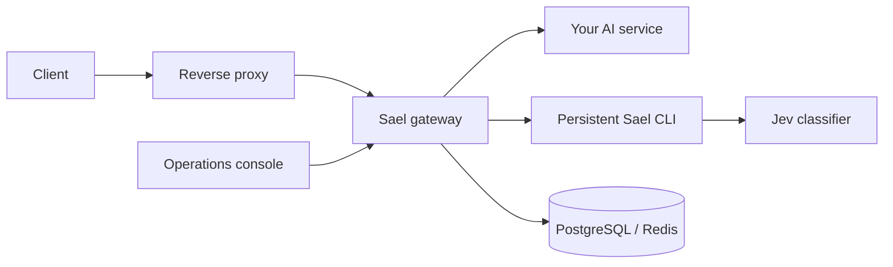

[简体中文](../README.md) · **English**

<div align="center">

# Sael

**Configure, test, and trace safety rules for AI requests**

A text review gateway between your clients and AI services, with a visual operations console.

[](https://github.com/cipherTing/sael/actions/workflows/ci.yml)
[](https://pkg.go.dev/github.com/cipherTing/sael/sdk)
[](../LICENSE)

[Quick start](#quick-start) · [Deployment guide](../gateway/README.md) · [CLI and SDK](cli_en.md) · [Contributing](../CONTRIBUTING.md)

</div>


## What is Sael?

Sael adds text safety review to existing AI services. Clients use the Sael ingress address with their existing API key. The gateway applies scenarios to the current user input, blocks or records matches, and forwards requests to your configured AI service. Classification is provided by [Jev](https://docs.typesafe.ai/models).

Configure rules in the console, compare a draft with the active policy, and follow dashboard data into individual problem requests. Sael supports OpenAI and Anthropic request formats while preserving request bodies, credentials and streaming responses.

| What you need | What Sael provides |
| --- | --- |
| Different rules for different APIs and models | Scenario scopes, any/all conditions, raw score thresholds and drag ordering |
| Validate a rule before saving it | Text testing, active/draft comparison and templates from existing scenarios |
| See how review is running | Live RPM, traffic and hit trends, outcome composition, latency distribution and cache efficiency |
| Locate concentrated risk | Scenario, credential and source IP rankings with filtered record drilldown |
| Investigate a request | Redacted text previews and full text, masked keys, conversation association and matched scores |
| Handle repeated violations | Reused review decisions and optional session freezes per scenario |

## Organize rules as scenarios

Each scenario owns its thresholds and action. Select endpoints and models, combine conditions, and drag scenarios to set priority. Sliders and numeric inputs support both quick adjustments and exact values. Testing lives in the editor, so you can compare active and draft results before saving.


## From an overview to a problem request

Trends, composition, distributions and rankings show review activity together. Time range and time granularity are separate controls. Endpoint, model and other filters carry through to request records.


Individual records contain scenario hits, classifier failures and gateway warnings. Clean requests do not store individual prompt bodies. Recorded text is redacted; API keys are stored encrypted and displayed only as masked values. The console currently uses Chinese labels.

Screenshots show the local console with sample data.

## Architecture


```mermaid
flowchart LR
    Client[Client] --> Proxy[Reverse proxy]
    Proxy --> Gateway[Sael gateway]
    Gateway --> Upstream[Your AI service]
    Admin[Operations console] --> Gateway
    Gateway --> CLI[Persistent Sael CLI]
    CLI --> Jev[Jev classifier]
    Gateway --> Store[(PostgreSQL / Redis)]
```

Client ingress and the management console listen on separate ports. Docker Compose starts the gateway, PostgreSQL and Redis together; the forwarding destination and review settings are managed in the console.

## Quick start

Have Docker Compose ready, along with the address, model and API key for a working Jev service.

```sh
git clone https://github.com/cipherTing/sael.git
cd sael/gateway/deploy
cp .env.example .env
openssl rand -base64 32
```

Edit `.env` to set the administrator, PostgreSQL and two Redis passwords. Put the generated encryption key in `CREDENTIAL_ENCRYPTION_KEY` and keep a backup. There is no default console password.

```sh
docker compose up --build -d --wait
```

| Entry | Default address |
| --- | --- |
| Operations console | `http://localhost:8080` |
| Client ingress | `http://localhost:8081` |

Review starts disabled. Sign in using `ADMIN_PASSWORD` from `.env`. Host ports can be changed in `.env`; by default they bind only to the host loopback address. Use a reverse proxy for external access.

1. Set the forwarding Base URL under **设置 → 接入**.
2. Configure and test Jev under **设置 → Jev 分类器**.
3. Create scenarios and test text under **场景**.
4. Enable global review under **设置 → 审查**.
5. Point your client at the ingress address, retain its existing API key, and inspect the overview and records.

An API key joins the trusted list after its first successful verification by the upstream; subsequent requests are reviewed according to scenarios. OpenAI clients typically use `http://localhost:8081/v1` as their API base.

From the repository root, `npm run docker:up`, `docker:rebuild`, `docker:ps`, `docker:logs` and `docker:down` also manage the containers. See the [gateway guide](../gateway/README.md) for deployment and configuration details.

## CLI, SDK and development

The CLI can review text independently. The Go SDK is a standalone Jev API client with no gateway dependency.

```sh
sael check "text to review"
sael check --questions gore,self_harm "review selected questions"
cat prompt.txt | sael check --json
```

| Documentation | Contents |
| --- | --- |
| [CLI and SDK](cli_en.md) | Installation, terminal configuration, commands and Go examples |
| [Gateway guide](../gateway/README.md) | Deployment, settings, record boundaries, local development and tests |
| [Contributing](../CONTRIBUTING.md) | Development conventions and contribution checks |
| [Security](../SECURITY.md) | Reporting security issues |

Use [GitHub Issues](https://github.com/cipherTing/sael/issues) for general questions and feature requests.

## License

[MIT](../LICENSE)
